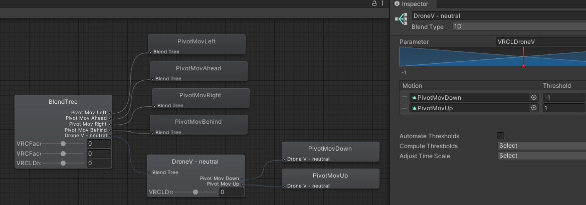

# VRCLensOSC

## Installation

Download VRCLensOSC: https://cafe.naver.com/steamindiegame/7077159

And buy from Booth to support the creator: https://booth.pm/en/items/4049205

Or build VRCLensOSC yourself from source: https://github.com/liArizenil/VRCLensOSC

## Usage

1. Enable OSC in VRChat (Action Menu: Options > OSC > Enabled)
2. Run VRCLensOSC.exe
3. Click "Connect" in VRCLensOSC. VRChat doesn't have to be running for this to work.
4. Click "Enable Shortkey" to enable keyboard shortcuts. Click "Disable Shortkey" to disable keyboard shortcuts when you're not using it anymore.

## Optional Setup in Unity

No additional setup is required to use VRCLensOSC.

However, if you want to use the Zoom/Exposure/Aperture/Focus controls, you must have `Use manual focus`, `Use zoom dial`, `Use exposure dial`, and/or `Use aperture dial` enabled in your VRCLens setup.

If you want to use the optional drone movement Switch (Y) to toggle between forward/back and up/down movement, you have to modify your avatar/VRCLens in Unity. The instructions are summarized below from the tutorial video: https://www.youtube.com/watch?v=j7kir6nPkyg

1. Add a `VRCLDroneSwitch` Int parameter to Expression Menu parameters (default `0`, Saved unchecked)
2. Add a `VRCLDroneSwitch` Int parameter to FX Layer parameters (default `0`)
3. Open FX Layer in Animator. In the `vCNP_Drone 212-214 i234` layer:
    1. Add a transition from `MoveH` to `MoveV` (right click `MoveH` > Make Transition > click `MoveV`). Select the new transition and add a condition, `VRCLDroneSwitch Equals 6`. Uncheck "Has Exit Time" and set the Transition Duration to `0`.
    2. Select the existing transition from `MoveV` to `MoveH`. Add a condition, `VRCLDroneSwitch NotEqual 6`.
    3. Add a transition from `RotateH` to `RotateV`. Select the new transition and add a condition, `VRCLDroneSwitch Equals 6`. Uncheck "Has Exit Time" and set the Transition Duration to `0`.
    4. Select the existing transition from `RotateV` to `RotateH`. Add a condition, `VRCLDroneSwitch NotEqual 6`.
4. Upload avatar. If the toggle doesn't work in game, delete your `%UserProfile%\AppData\LocalLow\VRChat\VRChat\OSC` folder and re-swap into your avatar.

## Compatibility and Risks

VRCLensOSC relies on internal details of VRCLens to work and may break in future VRCLens versions.

Additionally, when upgrading VRCLens, any FX layer modifications will be reset when you re-apply VRCLens, so you'll have to repeat the FX layer setup each time.

Upgrade VRCLens at your own risk! Last tested with VRCLens v1.8.1.

## Tips

### VRCLensOSC features

- Adjust drone speed using "Fo/Back", "Left/Right" number inputs. Ranges from `0` (slowest) to `1.0` (fastest), and default is `0.50`. E.g., to make drone move slower, change these to `0.1`. Alternatively, adjust drone speed in game using the radial menu, which can be more convenient.
- "Switch (Y)" switches drone movement from forward/back to up/down. See [Drone Move Switch Setup](#drone-move-switch-setup) to enable this.
- "OIS" is the hand stabilize feature

### VRCLens in desktop mode

- Enable "Hand Rotate" to rotate drone using mouse
- Switch between top right preview (Shift+F1), center preview (Shift+F2), and full screen preview (Shift+F3)
- Ensure DirectCast is turned off in VRCLens settings for post-processing to work (Advanced > Movie Mode)

---

## Personal Modifications

This repo contains my own modifications to VRCLensOSC and VRCLens:

- Remapped Drone Move Forward (T)/Left (F)/Right (H)/Back (G) to IJKL
- Unmapped Drone Move Switch (Y)
- Remapped Hand Rotate (End) to Page Down
- Remapped Track Self (Del) to Ctrl + Page Up
- Changed default zoom from 25% (24mm) to 12% (17mm)
- Changed default Drone Move step from 0.50 to 1.00
- Added hotkey to toggle Track Pivot (Page Up). Unmapped Page Up from Portrait.
- Added hotkey to toggle DoF (Home). Remapped Enable Drone to Ctrl + Home (press and hold to disable).
- Added hotkey to toggle Avatar AutoFocus (Shift + Home)
- Added hotkey to toggle Stabilize/OIS (Ctrl + Page Down)
- Added hotkey to toggle Drop Pivot (Shift + Insert)
- Added hotkey to reset Zoom (Shift + =)
- Added Drove Move Up (O) and Down (U) hotkeys to enable 3-dimensional movement. Requires VRCLens/avatar modifications in Unity. See [optional 3-dimensional movement setup](#optional-3-dimensional-movement-setup).
- Added Shift + IJKL (forward, left, back, right) and Shift + OU (up, down) hotkeys to move drone pivot using keyboard
- Added hotkey to toggle Drone max speed or "Turbo" mode (R Alt)
- Added support for XBox controller input when Enable Shortkey is used. Left thumbstick controls horizontal drone movement. Max speed is limited to Drone Move steps, while min speed is limited to Min Move step.
- Added hotkey to toggle Enable Shortkey (Ctrl + ~)
- Added hotkey to toggle Focus Peaking (Del)
- Added support for drone movement without interruption from other toggles. Requires VRCLens/avatar modifications in Unity. See [optional drone movement without interruption setup](#optional-drone-movement-without-interruption-setup).
- Added hotkey to always turn DoF off (Alt + Home). Requires VRCLens/avatar modifications in Unity. See [optional DoF off toggle setup](#optional-dof-off-toggle-setup).

### Optional 3-dimensional movement setup

To enable vertical drone movement with the Drove Move Up (O) and Down (U) keys in horizontal movement mode:

1. Add a `VRCLDroneV` Float parameter to Expression Menu parameters (default `0`, Saved unchecked)
2. Add a `VRCLDroneV` Float parameter to FX Layer parameters (default `0`)
3. Open FX Layer in Animator. In the `vCNP_Drone 212-214 i234` layer:
    1. Double click to open the `MoveH` blend tree.
    2. Right click the blend tree and add a new 1D blend tree. Set Parameter to `VRCLDroneV` and add 3 motion fields. Uncheck Automate Thresholds. Set motion fields with thresholds: `MovFastDown` (`-1`), `MovNeutral` (`0`), and `MovFastUp` (`1`).
    3. Repeat step 2 to create 5 identical nested 1D blend trees, one for each direction (ahead/behind/left/right/neutral). For their `Pos X`/`Pos Y` values, use `(0,1)`, `(0,-1)`, `(1,0)`, `(-1,0)`, and `(0,0)`.
4. Upload avatar. If the toggle doesn't work in game, delete your `%UserProfile%\AppData\LocalLow\VRChat\VRChat\OSC` folder and re-swap into your avatar.


To enable vertical pivot movement with the Drove Move Up (O) and Down (U) keys:

1. Open FX Layer in Animator. In the `vCNP_Drone 212-214 i234` layer:
    1. Double click to open the `PivotMove` blend tree.
    2. Right click the blend tree and add a new 1D blend tree. Set Parameter to `VRCLDroneV` and add 2 motion fields. Uncheck Automate Thresholds. Set motion fields with thresholds: `PivotMovDown` (`-1`), `PivotMovUp` (`1`). `PivotMovUp`/`PivotMovDown` should already exist in the VRCLens project (but just unused).
2. Optionally adjust speed of pivot movement animations since they're very fast by default, e.g., lower from `0.2` to `0.05`.



### Optional drone movement without interruption setup

To allow drone movement without interruption from other toggles, create a new parameter to use for the movement toggle so it doesn't overlap with other toggles.

1. Add a `VRCL_Custom/DroneMove` Int parameter to Expression Menu parameters (default `0`, Saved unchecked)
2. Add a `VRCL_Custom/DroneMove` Int parameter to FX Layer parameters (default `0`)
3. Open FX Layer in Animator. In the `vCNP_Drone 212-214 i234` layer:
    1. Change all transitions that use `VRCLFeatureToggle Equals 212` to `VRCL_Custom/DroneMove Equals 212`: `Idle -> InitDrop`, `InitDropReset -> MoveH`.
    2. Change all transitions that use `VRCLFeatureToggle NotEquals 212` to `VRCL_Custom/DroneMove NotEquals 212`: `MoveH -> DroneStop`, `MoveV -> DroneStop`.
    3. Change the `DroneStop [i3]` state's parameter driver to set `VRCLInterrupt` to `0` instead of `3`.
4. Upload avatar. If the toggle doesn't work in game, delete your `%UserProfile%\AppData\LocalLow\VRChat\VRChat\OSC` folder and re-swap into your avatar.

### Optional DoF off toggle setup 

To toggle DoF off from either Av or DEP mode, create a new parameter for custom feature toggles and modify the animator:

1. Add a `VRCL_Custom/FeatureToggle` Int parameter to Expression Menu parameters (default `0`, Saved unchecked)
2. Add a `VRCL_Custom/FeatureToggle` Int parameter to FX Layer parameters (default `0`)
3. Open FX Layer in Animator. In the `vCNT_DoF 11` layer:
    1. Add a transition from `DoFEnabled` to `DoFDisabled`. Uncheck "Has Exit Time" and set the Transition Duration to `0`. Add a condition, `VRCL_Custom/FeatureToggle Equals 11`.
    2. Add the same transition from `DoFAvDisabled` to `DoFDisable`.
4. Upload avatar. If the toggle doesn't work in game, delete your `%UserProfile%\AppData\LocalLow\VRChat\VRChat\OSC` folder and re-swap into your avatar.

## Build from source

Requirements:

- Visual Studio 2017+ with .NET desktop development tools
  - Or Build Tools for Visual Studio 2017 (https://visualstudio.microsoft.com/vs/older-downloads/) and NuGet (https://learn.microsoft.com/en-us/nuget/consume-packages/install-use-packages-nuget-cli)
- .NET Framework 4.7.2: https://dotnet.microsoft.com/en-us/download/visual-studio-sdks

```powershell
nuget restore

msbuild -p:Configuration=Release

# Then run VRCLensOSC\bin\Release\VRCLensOSC.exe
```
