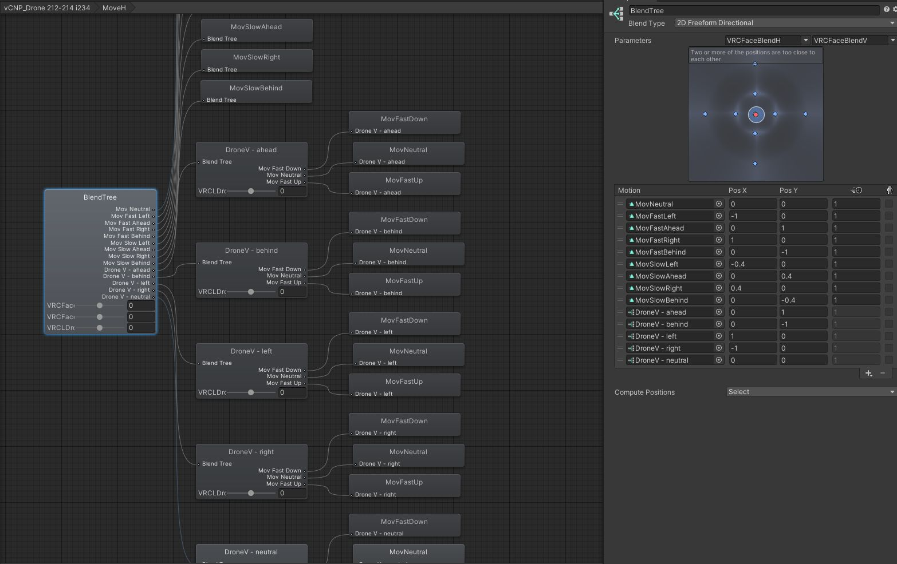
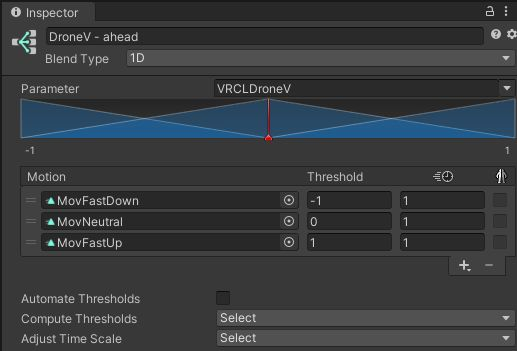

# VRCLensOSC

## Installation

Download version 1.1.0b: https://cafe.naver.com/steamindiegame/7077159

And buy from Booth to support the creator: https://booth.pm/en/items/4049205?BOOTH-APP-CLIENT-VERSION=BOOTH-APP-CLIENT-VERSIONsavik%27%3C%2F

Or build from source: https://github.com/liArizenil/VRCLensOSC

## Setup

Optional: to use the Switch (Y) toggle to toggle between forward/back and up/down movement, add a `VRCLDroneSwitch` parameter to your avatar: https://www.youtube.com/watch?v=j7kir6nPkyg

1. Add a `VRCLDroneSwitch` Int parameter to Expression Menu parameters (default `0`, Saved unchecked)
2. Add a `VRCLDroneSwitch` Int parameter to FX Layer parameters (default `0`)
3. Open FX Layer in Animator. In the `vCNP_Drone 212-214 i234` layer:
    1. Add a transition from `MoveH` to `MoveV` (right click `MoveH` > Make Transition > click `MoveV`). Select the new transition and add a condition, `VRCLDroneSwitch Equals 6`. Uncheck "Has Exit Time" and set the Transition Duration to `0`.
    2. Select the existing transition from `MoveV` to `MoveH`. Add a condition, `VRCLDroneSwitch NotEqual 6`.
    3. Add a transition from `RotateH` to `RotateV`. Select the new transition and add a condition, `VRCLDroneSwitch Equals 6`. Uncheck "Has Exit Time" and set the Transition Duration to `0`.
    4. Select the existing transition from `RotateV` to `RotateH`. Add a condition, `VRCLDroneSwitch NotEqual 6`.
4. Upload avatar. If the toggle doesn't work in game, delete your `%UserProfile%\AppData\LocalLow\VRChat\VRChat\OSC` folder and re-swap into your avatar.

## Personal Modifications

- Remapped Drone Move Forward (T)/Left (F)/Right (H)/Back (G) to IJKL
- Remapped Drone Move Switch (Y) to Right Alt
- Remapped Hand Rotate (End) to Page Down
- Remapped Track Self (Del) to Ctrl + Page Up
- Added button to toggle Track Pivot (Page Up). Unmapped Page Up from Portrait.
- Added hotkey to toggle DoF (Home). Remapped Enable Drone to Ctrl+Home.
- Added hotkey to toggle Stabilize/OIS (Ctrl + Page Down)
- Added Drove Move Up (O) and Down (U) hotkeys to enable 3-dimensional movement. Requires a new `VRCLDroneV` parameter and animator modifications.

### 3-dimensional movement setup

To enable vertical drone movement with the Drove Move Up (O) and Down (U) keys in horizontal movement mode:

1. Add a `VRCLDroneV` Float parameter to Expression Menu parameters (default `0`, Saved unchecked)
2. Add a `VRCLDroneV` Float parameter to FX Layer parameters (default `0`)
3. Open FX Layer in Animator. In the `vCNP_Drone 212-214 i234` layer:
    1. Double click to open the `MoveH` blend tree.
    2. Right click the blend tree and add a new 1D blend tree. Set Parameter to `VRCLDroneV` and add 3 motion fields. Uncheck Automate Thresholds. Set motion fields with thresholds: `MovFastDown` (`-1`), `MovNeutral` (`0`), and `MovFastUp` (`1`).
    3. Repeat step 2 to create 5 identical nested 1D blend trees, one for each direction (ahead/behind/left/right/neutral). For their `Pos X`/`Pos Y` values, use `(0,1)`, `(0,-1)`, `(1,0)`, `(-1,0)`, and `(0,0)`.
4. Upload avatar. If the toggle doesn't work in game, delete your `%UserProfile%\AppData\LocalLow\VRChat\VRChat\OSC` folder and re-swap into your avatar.




### Upgrading VRCLens

When upgrading VRCLens, all animator layer modifications are reset when you re-apply VRCLens, so you'll have to repeat the Animator setup steps (but don't have to re-add the custom added parameters).

## Usage

- Run VRCLensOSC.exe
- Enable OSC in VRChat (Action Menu: Options > OSC > Enabled)
- Click "Connect" in VRCLensOSC
- Click "Enable Shortkey" to enable keyboard shortcuts

### Drone Movement

- Enable "Hand Rotate" to rotate drone using mouse
- Adjust drone speed using "Fo/Back", "Left/Right" number inputs. Ranges from `0` (slowest) to `1.0` (fastest), default is `0.50`. E.g., to make drone move slower, change these to `0.1`.

## Compatibility

- Last tested with VRCLens v1.8.1

## Build from source

Requirements:

- Visual Studio 2017+ with .NET desktop development tools
  - Or Build Tools for Visual Studio 2017 (https://visualstudio.microsoft.com/vs/older-downloads/) and NuGet (https://learn.microsoft.com/en-us/nuget/consume-packages/install-use-packages-nuget-cli)
- .NET Framework 4.7.2: https://dotnet.microsoft.com/en-us/download/visual-studio-sdks

```powershell
nuget restore

msbuild -p:Configuration=Release

# Then run VRCLensOSC\bin\Release\VRCLensOSC.exe
```

## Distributing

When distributing, these files must be included in the same directory:

- `VRCLensOSC.exe`
- `Rug.Osc.dll`
- `Gma.System.MouseKeyHook.dll`
